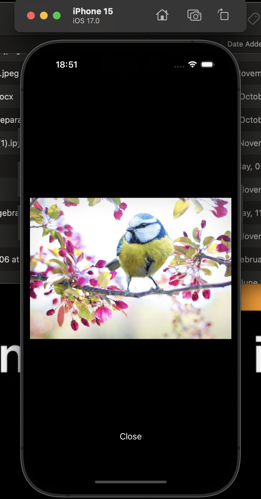
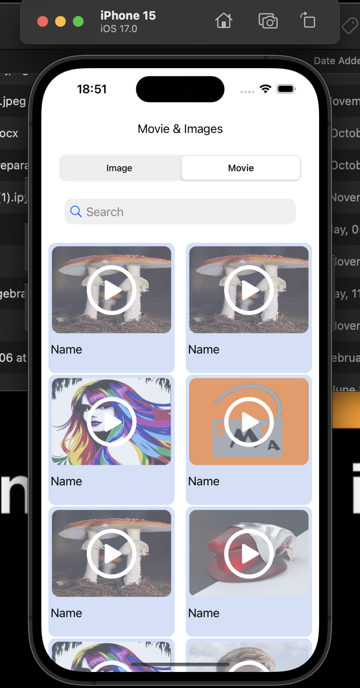
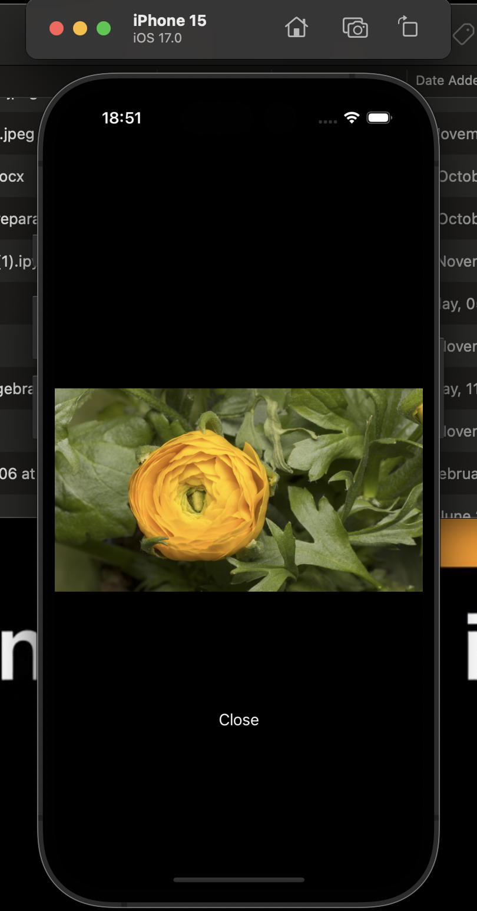

#  This Main target of this project was working with server and API

The main task was to work with the server. I had to get the data. Write functions for data processing. After processing, it was necessary towork with View elements in order to update them after receiving the data. 

To do this, I used asynchronous requests to work with threads. 

Then I worked with the data itself, when I clicked on the cell, a new controller opened. If there was an image in the data, then he just showed it. and if the video was just a picture at first, and before the picture there was a button to start the video. When pressed, the video started.

Installation scheme:
Main controller (ViewController) - > second countercontroller, when clicking on the cell (TappedViewController)

SCREENSHOTS:

